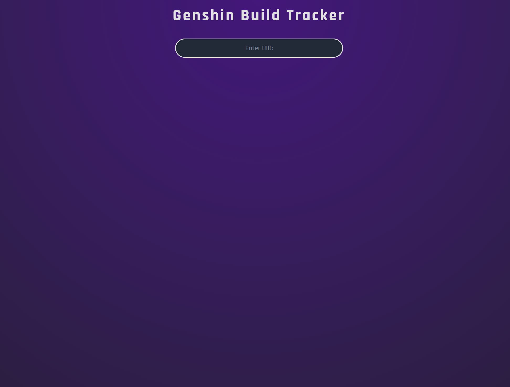
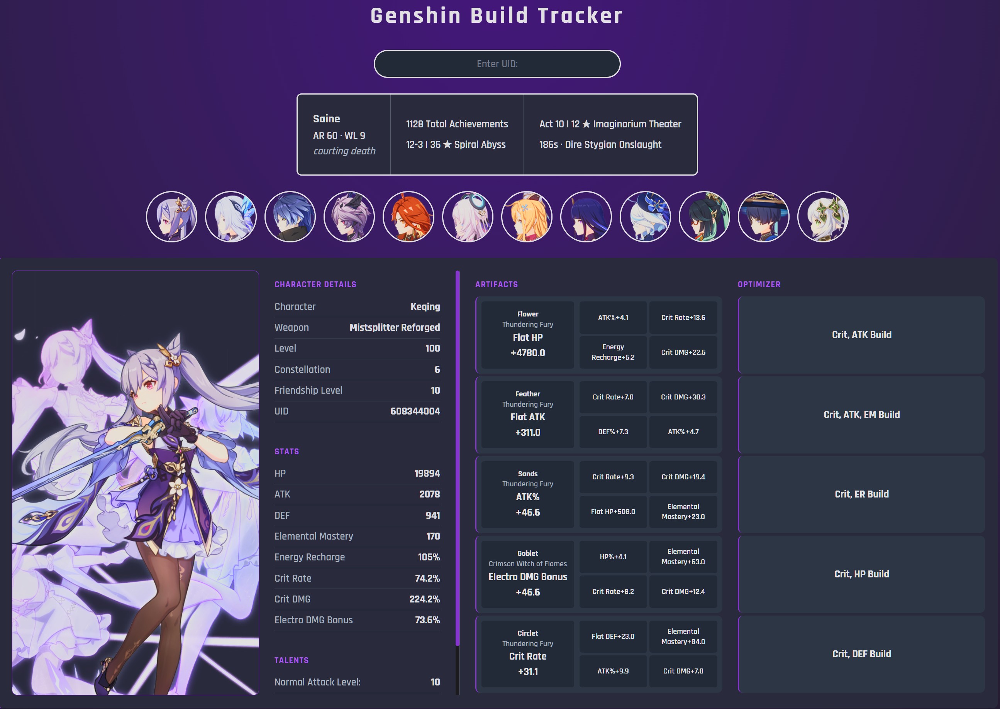
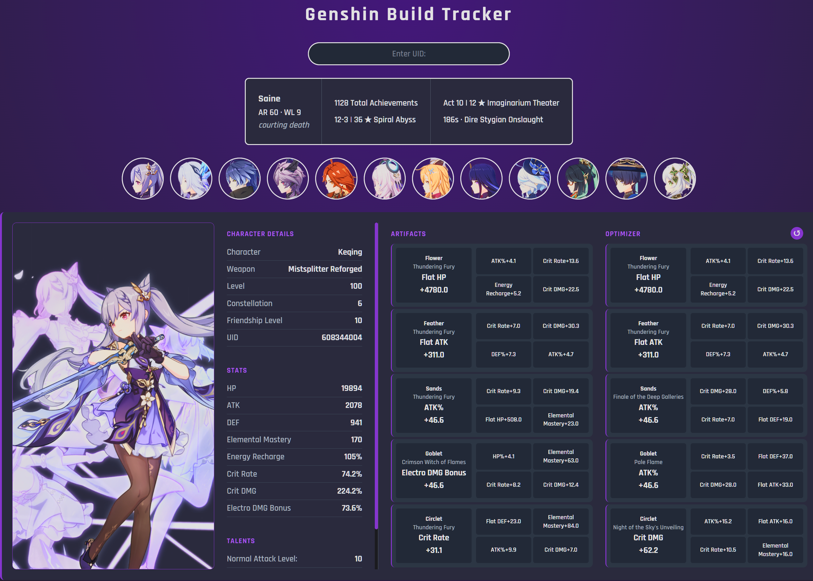

# Genshin Build Tracker

## About

Genshin Build Tracker is a full-stack web app that fetches a player's showcased characters from the enka.network API and
displays their stats, weapons, and artifacts. A built-in artifact optimizer scores and ranks artifacts per slot based on
a selected build type, returning the best combination for that character.

Inspired by enka.network and akasha.cv after six years of playing Genshin Impact. I wanted to build something of my own
around a game I actually care about.

## Live Demo

> [Live App](http://44.204.214.240:5000)

## Features

- Card-based UI
- UID Lookup
- Showcase character details
- Showcase equipped artifacts and weapon
- Built-in artifact optimizer
- Data synced from enka.network API
- PostgreSQL persistence, all data stored across sessions
- Pydantic validation on all incoming API data
- Deployed on AWS ECS with RDS PostgreSQL backend
- Automated CI/CD pipeline, tested and deployed on every merge to master

## Tech Stack

- **PostgreSQL**: production-ready database with support for concurrent reads/writes and native AWS RDS compatibility.
- **SQLAlchemy ORM**: maps Python models directly to database tables, handling inserts and upserts without writing raw
  SQL.
- **Pandas**: vectorized scoring across all artifacts at once, applying build formulas to entire DataFrames in a single
  operation.
- **Flask**: lightweight web framework, no unnecessary overhead for a project of this scope.
- **Pydantic**: validates and enforces types on raw API data from enka.network before it touches the database.
- **Docker**: containerizes the app for consistent local development and seamless AWS deployment.
- **AWS (ECR, ECS, RDS)**: managed cloud infrastructure. ECR stores the image, ECS with Fargate runs the container, RDS
  hosts the production database. No server management required.
- **pytest**: unit tests covering parsers and schema validation to catch bad API data early.
- **Jinja2**: server-side templating for dynamic rendering of character and artifact data.
- **GitHub Actions**: runs the tests on every pull request and ships the app to ECS when a branch merges into master. It
  logs into AWS with OIDC, so there are no AWS keys sitting in the repo or in GitHub secrets.

## CI/CD

Merging to `master` ships the app on its own. There are no manual steps and nothing to click.

1. **Test**: pytest runs first. If it fails, nothing else happens.
2. **Authenticate**: the runner asks GitHub for a signed token and trades it to AWS for credentials that expire in an
   hour. Nothing long-lived gets stored anywhere.
3. **Build and push**: the image goes up to ECR tagged with the commit SHA, so I can always tell exactly which code is
   running in a container.
4. **Deploy**: it pulls the live task definition, swaps in the new image, registers it as a new revision, and points the
   service at it. Then it waits for ECS to actually finish the rollout, so a green check means the new version is
   running and not just requested.

Pull requests only run the tests. The deploy job is skipped, and the AWS trust policy will not accept a token from
anything but master, so an unmerged branch cannot reach AWS even if it tried. The role it does assume can only push to
this one ECR repo and update this one ECS service.

Nothing gets to master without a pull request and a passing test run.

## Running Locally

1. Clone the repo

```bash
git clone https://github.com/saineee/genshin_app.git
cd genshin_app
```

2. Create a `.env` file in the project root with your own credentials

```env
DATABASE_URL=postgresql://your_user:your_password@db:5432/your_dbname
```

> The your_user, your_password, and your_dbname can be anything. Docker will create the database using these credentials on first run.

3. Run with Docker

```bash
docker compose up --build
```

4. Visit `http://localhost:5000`

## Screenshots

### Homepage



### Character View



### Optimizer



## Cost

All of it runs in us-east-1 and costs about $13 a month right now.

Fargate is most of that, roughly $9 for a 0.25 vCPU task with 0.5 GB of memory running 24/7. The public IP on the task
is another $3.65. ECR storage costs almost nothing right now, but it will grow, since every merge pushes another image.
The database is a db.t3.micro with 20 GB, which would run about $15 on its own but is free for the first year, so the
real bill lands closer to $28 once that runs out.

If this ever got real traffic, the first things I would change are a lifecycle policy on ECR so old images stop
stacking up, a load balancer in front of the task instead of giving it a public IP, and a schedule that shuts the
service down overnight, since nobody is looking up their artifacts at 4am.

## Planned Improvements

- Terraform to manage the AWS infrastructure as code
- ECS health checks and deployment rollback in case of a bad deploy

## License

MIT, see [LICENSE](LICENSE).